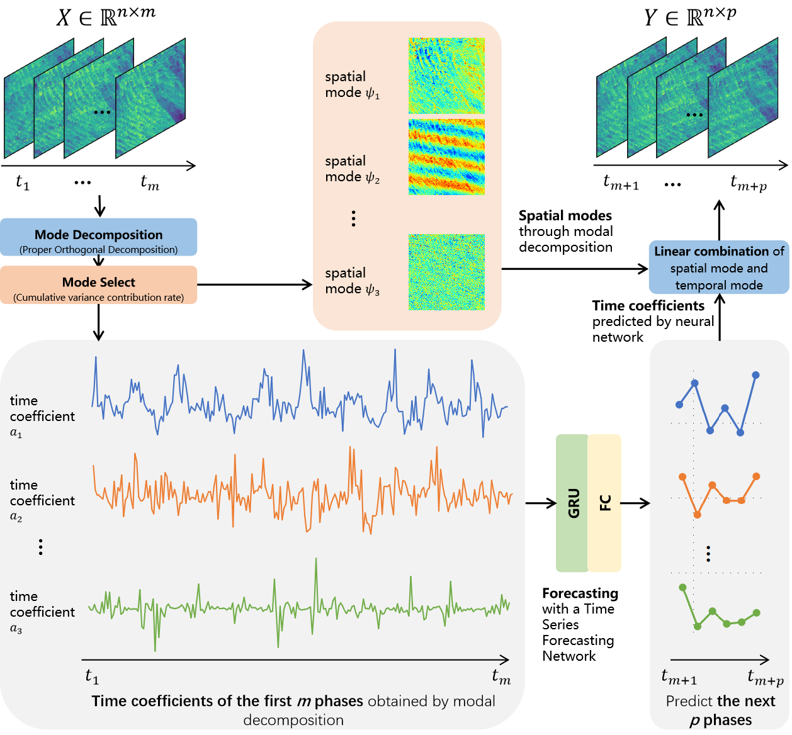
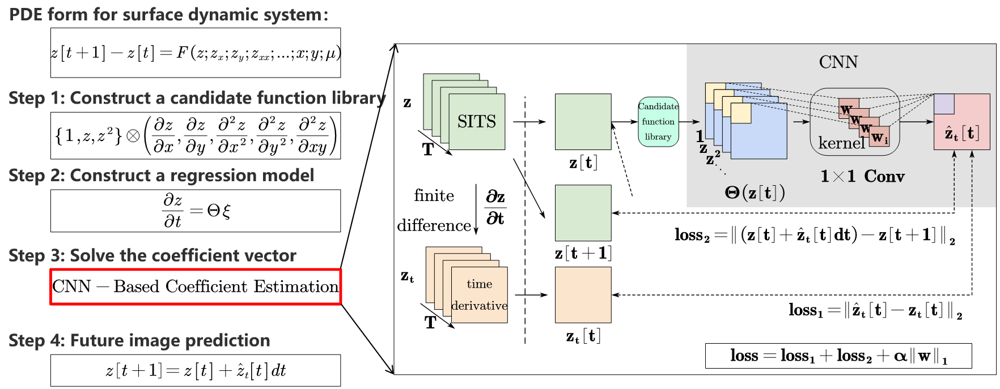
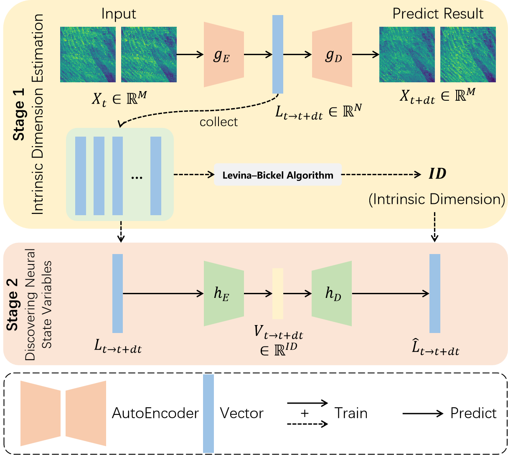
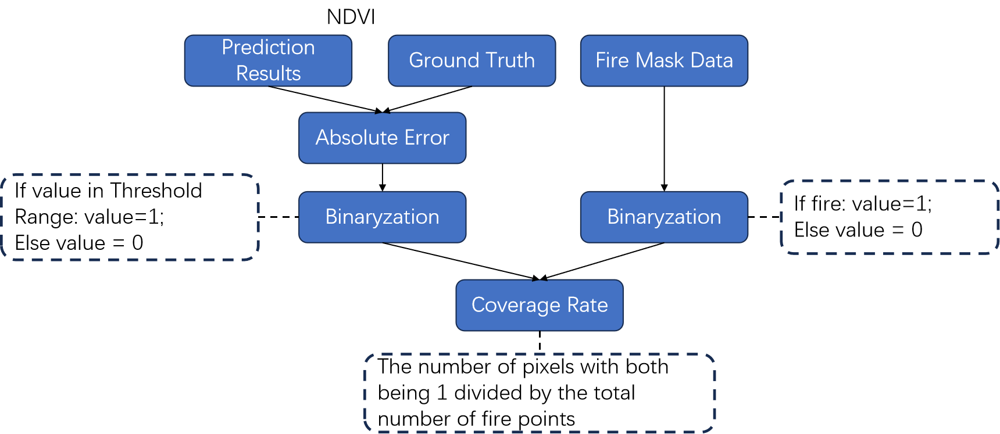

# 🌍 **Satellite Image Time Series-Driven Land Surface Dynamic Modeling and Prediction**

> Modeling, prediction, imputation, and anomaly detection of land surface dynamics using satellite image time series.

---

## 📖 Overview


This repository provides implementations of three time-series-driven methods for **modeling land surface dynamics** and **predicting satellite image sequences**:

* **POD with Temporal Prediction**
  Proper Orthogonal Decomposition combined with temporal modeling

* **SINDy**
  Sparse Identification of Nonlinear Dynamics
  [Brunton et al., 2016](https://pnas.org/doi/full/10.1073/pnas.1517384113) | [Kang et al., 2025](https://www.mdpi.com/2072-4292/17/7/1211)

* **SVDM**
  State Variable Discovery Model
  [Chen et al., 2022](https://www.nature.com/articles/s43588-022-00281-6)

Additional components include:

* **POD-based imputation** for missing time points
* A **threshold-based fire anomaly detection method**

---

## 🧩 Method Frameworks

+ Modeling and Prediction with POD and Temporal Forecasting
<p align="center">
  
</p>


+ SINDy Framework for Sparse Dynamic Modeling
<p align="center">
  
</p>

+ State Variable Discovery Model (SVDM)
<p align="center">
  
</p>

+ Threshold-Based Fire Anomaly Detection Workflow
<p align="center">
  
</p>


> POD with temporal imputation follows the same steps as POD prediction, but uses 1D interpolation instead of forecasting.

---

## ⚙️ Installation

Clone the repository and install dependencies:

```bash
git clone https://github.com/keli-shi/LandSurfaceDynamics.git
cd LandSurfaceDynamics
cd [SUBDIR]
pip install -r requirements.txt
```

---

## 🚀 Usage

### POD with Temporal Prediction

```bash
python POD_Predictor.py \
  --data_path ningxia-mod13a2_2011-2020.npy \
  --num_predict 20 \
  --hidden_size 256 \
  --num_layers 2 \
  --epochs 500 \
  --lr 0.001 \
  --time_step 10 \
  --split_ratio 0.9 \
  --batch_size 10
```

---

### SINDy for Modeling and Prediction

```bash
python sindy_pred_single.py \
  --npy_path "0_0.npy" \
  --save_dir "results" \
  --steps_predict 23 \
  --epoches 1000 \
  --l1_alpha 0.01 \
  --lr 0.005 \
  --batch_size 16 \
  --device cpu
```

---

### SVDM Workflow

**Step 1: Stage-1 autoencoder training**

```bash
python main.py configs/ndvi/model64/config.yaml
```

**Step 2: Extract latent variables**

```bash
python eval.py configs/ndvi/model/config.yaml logs_ndvi_encoder-decoder-64_1/lightning_logs/checkpoints NA eval-train NA
```

> Move `latent.npy` to the `variables/` folder.

**Step 3: Estimate intrinsic dimension**

```bash
python analysis/eval_intrinsic_dimension.py configs/ndvi/model64/config.yaml model-latent NA
python utils/dimension.py ndvi
```

**Step 4: Stage-2 training & state variable extraction**

```bash
python main.py configs/ndvi/refine/config.yaml
python eval.py configs/ndvi/refine64/config.yaml logs_ndvi_refine-64_1/lightning_logs/checkpoints logs_ndvi_encoder-decoder-64_1/lightning_logs/checkpoints eval-refine-train NA
```

**Step 5: Prediction (three strategies)**

```bash
# Stage 1 + Stage 2
python pred.py model-rollout configs/ndvi/refine64/config.yaml logs_ndvi_encoder-decoder-64_1/lightning_logs/checkpoints logs_ndvi_refine-64_1/lightning_logs/checkpoints NA 22

# Stage 1 only
python pred.py model-rollout configs/ndvi/model64/config.yaml logs_ndvi_encoder-decoder-64_1/lightning_logs/checkpoints NA NA 22

# Hybrid strategy (k-selection)
python pred.py hybrid-3 configs/ndvi/refine64/config.yaml logs_ndvi_encoder-decoder-64_1/lightning_logs/checkpoints logs_ndvi_refine-64_1/lightning_logs/checkpoints NA 22
```

**Step 6: TensorBoard for visualization**

```bash
tensorboard --logdir logs_ndvi_encoder-decoder-64_1/lightning_logs/ --port 6006
```

---

### POD with Temporal Imputation

Directly use the provided Jupyter notebook (`.ipynb`) for missing data reconstruction.

---

### 🔥 Fire Anomaly Detection

**Step 1: Extract 8-day fire masks from MOD14A1 (.hdf → .tif)**

```bash
python extract_fire_8daily.py \
  --dir_path /path/to/data \
  --output_dir /path/to/save/output
```

**Step 2: Find optimal threshold range**

```bash
python find_best_threshold.py \
  --folder_mask_dir ./predicted_masks \
  --folder_error_dir ./error_maps
```

**Step 3: Fire point detection & visualization**

```bash
python result_plot.py \
  --folder_mask_dir ./mask_folder \
  --folder_error_dir ./error_folder \
  --save_dir ./results \
  --threshold_low 0.4 \
  --threshold_high 0.85
```

---

## 🙏 Acknowledgements

* MODIS data provided by [NASA Earthdata](https://earthdata.nasa.gov/)

---

## 📚 References

```bibtex
@article{Tang2025Remote,
title={遥感时间序列驱动的地表动态变化过程建模},
author={唐娉 and 张正 and 史科理 and 亢明 and 赵智韬 and 赵俊芳 and 闫冬梅},
journal={遥感学报},
pages={1-23},
year={2025},
doi={10.11834/jrs.20254372},
}

@article{kang2025temporal,
  title={Temporal--Spatial Partial Differential Equation Modeling of Land Cover Dynamics via Satellite Image Time Series and Sparse Regression.},
  author={Kang, Ming and Zhang, Zheng and Zhao, Zhitao and Shi, Keli and Zhao, Junfang and Tang, Ping},
  journal={Remote Sensing},
  volume={17},
  number={7},
  year={2025}
}
```
